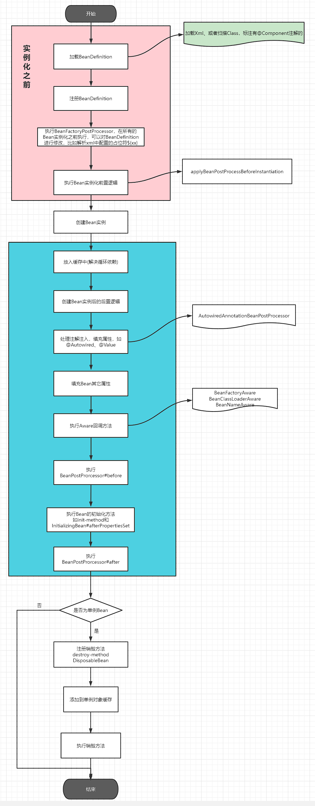

# small-spring

## Spring Bean的生命周期
整个SpringIOC容器的启动是在 `AbstractApplicationContext#refresh`中执行的，包含了整个Bean的生命周期
 

## BeanFactory和ApplicationContext的区别
- BeanFactory提供了基础Spring IOC的功能的基础，主要用于在Spring框架内部使用以及与其他第三方框架的集成
- ApplicationContext包含了BeanFactory支持的所有功能，ApplicationContext会自动检测几种Bean，例如注解处理和AOP代理，如果使用BeanFactory则不会执行，
包括对于BeanPostProcessor的检测和注册，BeanFactory都不会自动执行

## Spring IOC容器的扩展点
- 自定义Bean：`BeanPostProcessor`
- 自定义配置元数据：`BeanFactoryPostProcessor`
- 自定义Bean的初始化逻辑：`FactoryBean`

### BeanPostProcessor
用于在Bean实例化之后，执行初始化方法之前和执行初始化方法之后进行扩展；

初始化方法指的是我们配置的`init-method`或者`InitializingBean#afterproperties`

### BeanFactoryPostProcessor
用于在所有的Bean实例化之前，修改配置元信息，比如进行配置文件的读取，进行占位符替换`${}`，如`PropertyPlaceholderConfigurer`，

**注意事项**：在`BeanFactoryPostProcessor`中是不建议获取Bean实例(调用#getBean方法)，因为这样会导致Bean的提前实例化,一方面违反了Bean的生命周期约定，另一方面会导致BeanPostProcessor不执行

### FactoryBean

用于应对复杂的对象创建，无法用Java程序表达，例如xml，可以在FactoryBean中编写复杂的逻辑，然后将FactoryBean交给Spring IOC容器.

**注意事项：** 我们实现的FactoryBean在配置时需要将Bean名称注册为 '&'开头，见`BeanFactory#FACTORY_BEAN_PREFIX`，IOC容器在创建Bean时会以BeanName是否以`&`为前缀来判断是否为`FactoryBean`，
同时需要注意我们在使用Spring时如果不是FactoryBean的实现，也不要将Bean实例名称设置为`&`开头，会抛出`BeanIsNotAFactoryException`

 
