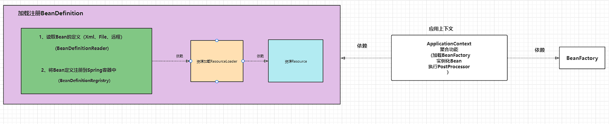

# 增加功能
- 优化现有的Spring.xml初始化和加载策略，取消暴露给用户`DefaultListableBeanFactory`
- 将初始化BeanFactory和读取配置文件、注册Bean的操作在内部执行
- 增加在Bean的初始化之前之后的扩展功能，`BeanFactoryPostProcessor`和`BeanPostProcessor`两个接口，主要为满足于在Bean对象从注册到实例化的过程中执行用户的自定义操作
  - `BeanFactoryPostProcessor` ：是由Spring框架提供的容器扩展机制，允许在Bean定义注册之后，但未实例化之前对BeanDefinition执行修改操作
  - `BeanPostProcessor`：是在Bean对象初始化之后修改Bean对象，也可以替换Bean对象

# 简易架构
- 主要分为两个模块
- `BeanDefinition`的加载和注册
- `BeanFactory`
- 应用上下文：将功能（`BeanDefinition`的加载和注册、`BeanFactory`）进行聚合，提供给用户统一的操作入口
