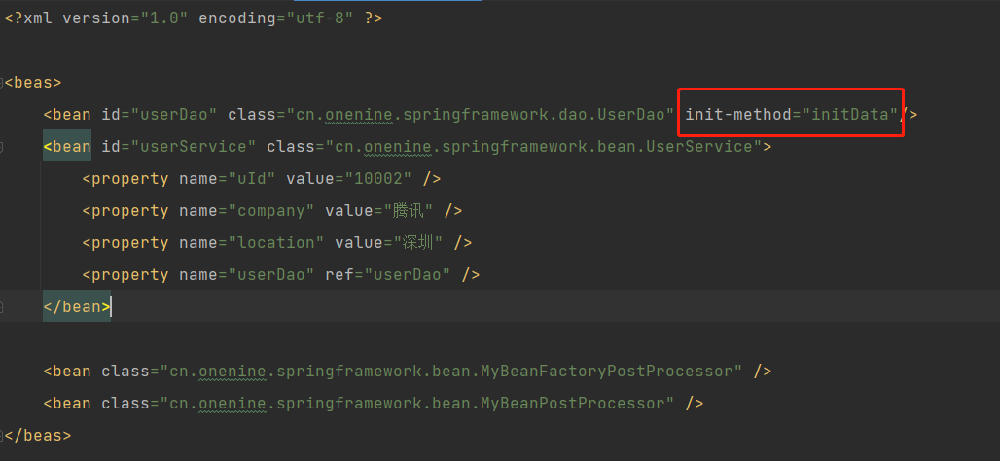

# 增加功能
- 增加获取Spring容器资源的接口，如常用的BeanFactory、ApplicationContext

# 实现
- 增加Aware标记接口，同时增加多个资源的`Aware`接口，继承`Aware`接口
- 在创建Bean执行初始化方法时`AbstractAutowireCapableBeanFactory#initializeBean`，增加对多个`Aware`的调用，除`ApplicationContext`外，因为创建Bean是在`BeanFactory`中执行的，无法获取`ApplicationContext`
- 因此定义一个BeanPostProcessor，在容器`refresh`的时候将ApplicationContext放到BeanFactory中，在执行BeanPostProcessor的前置处理时，为bean设置`ApplicationContextAwareProcessor`
 
# Spring Bean的生命周期
