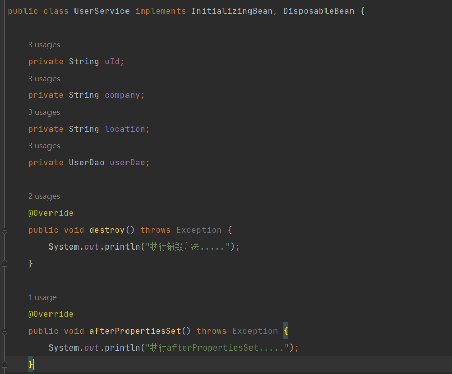

# 增加功能
- 增加Bean的生命周期回调，init-method和destroy-method，支持xml配置和实现接口两种方式
- xml配置：
  - 
- 通过实现接口，`InitializingBean`和`DisposableBean`：
  - 

# 实现
- xml配置的方式会在加载BeanDefinition时读取init-method和destroy-method两个标签
- init：在创建Bean `AbstractAutowireCapableBeanFactory#createBean`时执行初始化操作
- destroy：通过添加shutdownHook钩子函数，钩子中执行用户定义的destroy方法