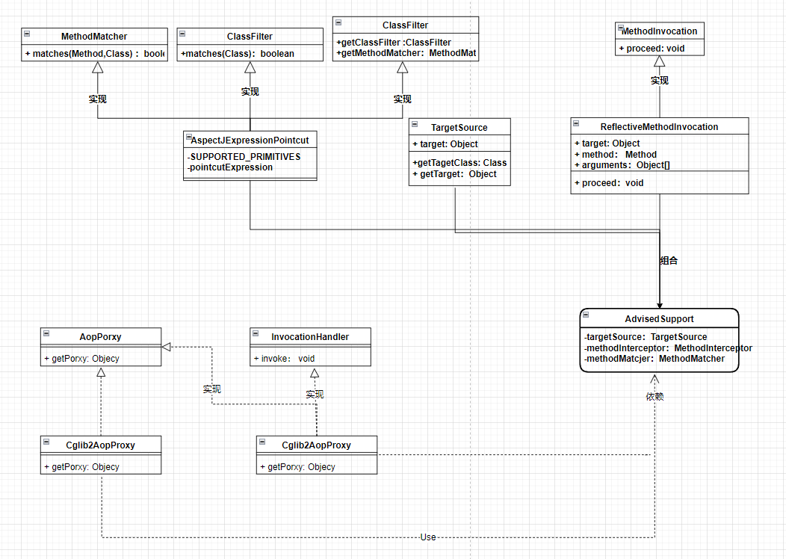

# 增加功能 - 实现简易AOP
## 需要的角色
### 功能支撑
- 方法匹配器（`Interface`）- 判断方法是否满足切点表达式
- 类过滤器（`Interface`）- 判断Class是否满足切点表达式
- 切点表达式类（`AspectJExpressionPointcut`） - 聚合实现方法匹配器、类过滤器
- 门面类（包装类）`AdvisedSupport` - 组合方法匹配器(`MethodMatcher`)、被代理的目标对象(`targetObject`)、用户自定义的拦截器(`MethodInterceptor`)
- 目标代理对象包装类（`TargetSource`）
- 对AOP联盟`MethodInvocation`的实现：`ReflectiveMethodInvocation`
### 对外API
- 获取代理对象 (`AopProxy`)
  - 具体获取代理对象的实现：Jdk、Cglib
- 拦截器：实现AOP联盟的`MethodInterceptor`，`MethodInterceptor`需要与`MethodInvocation`配合使用

# 类图

